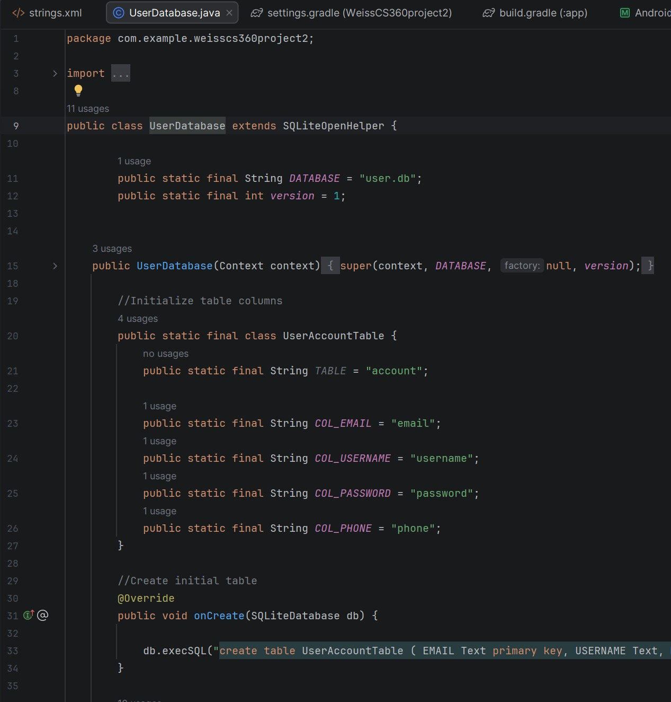
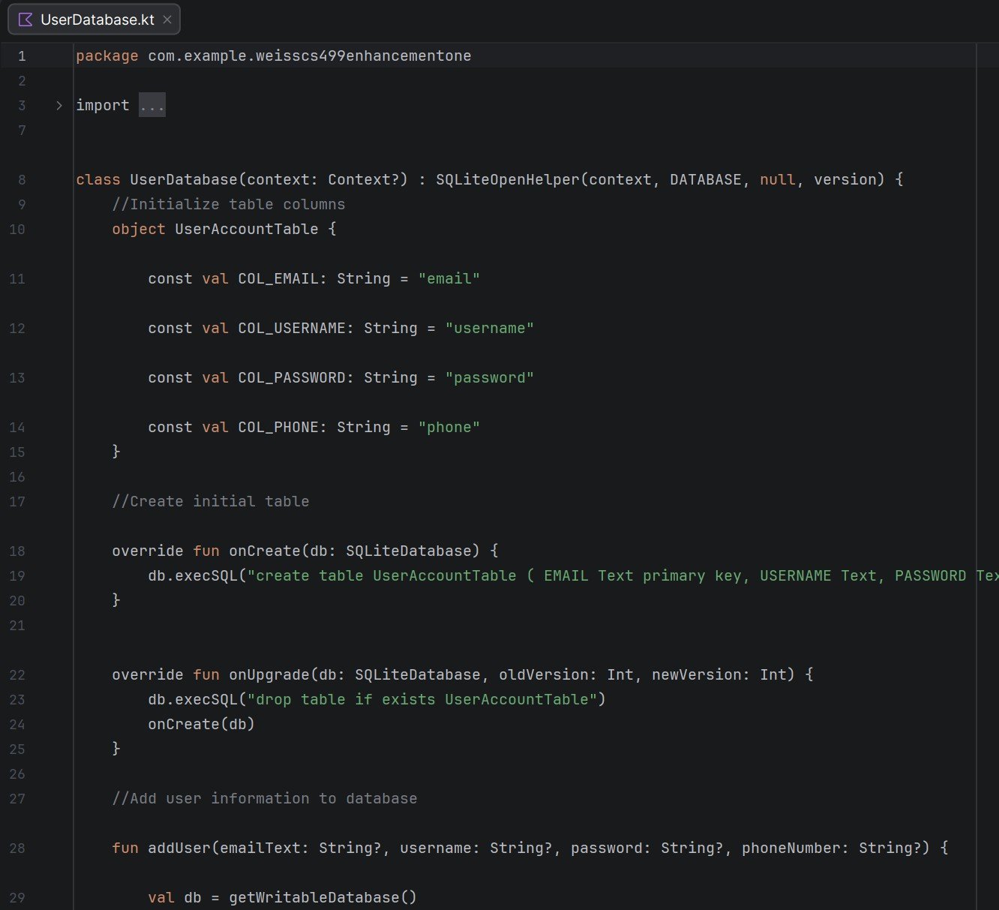
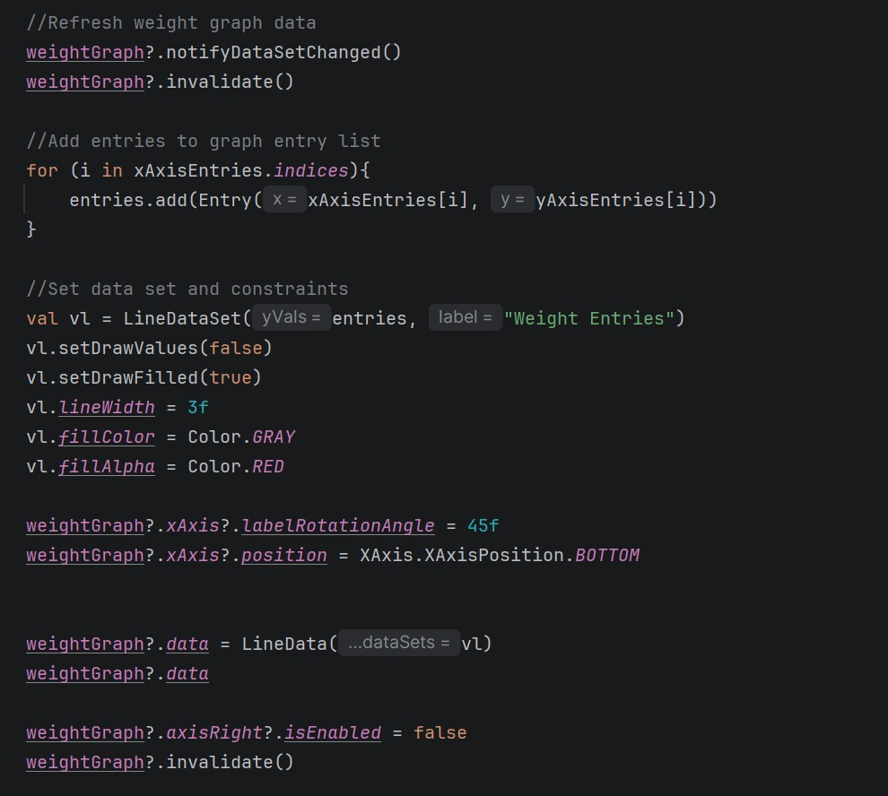
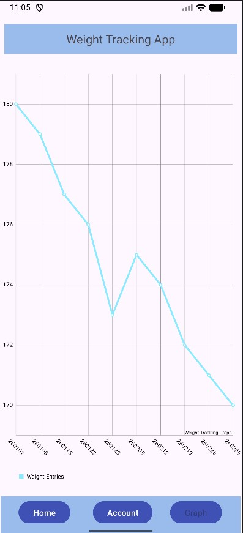
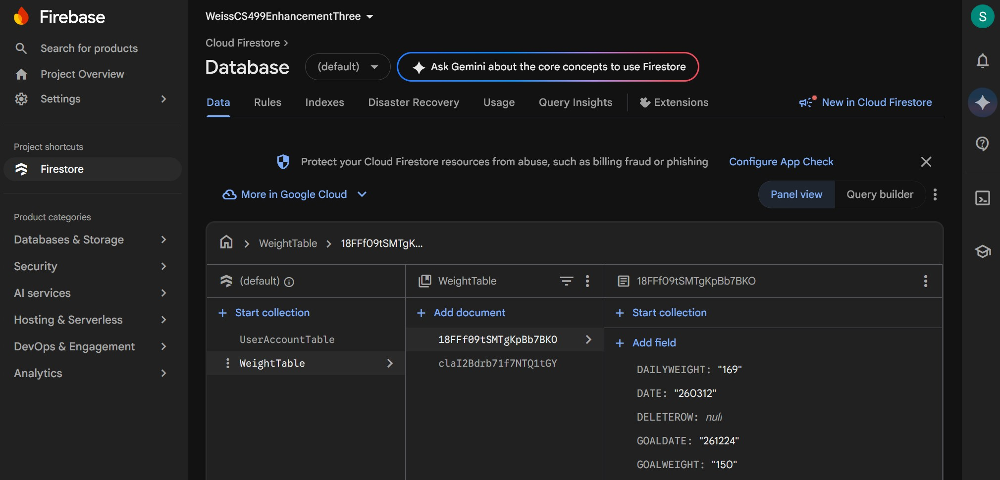
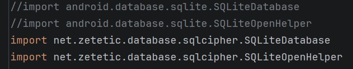
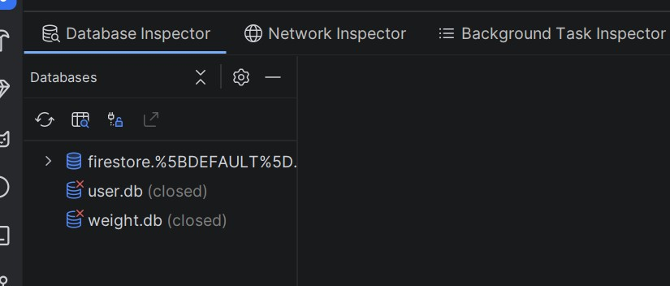
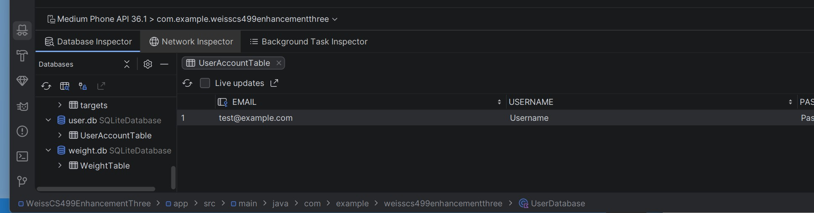
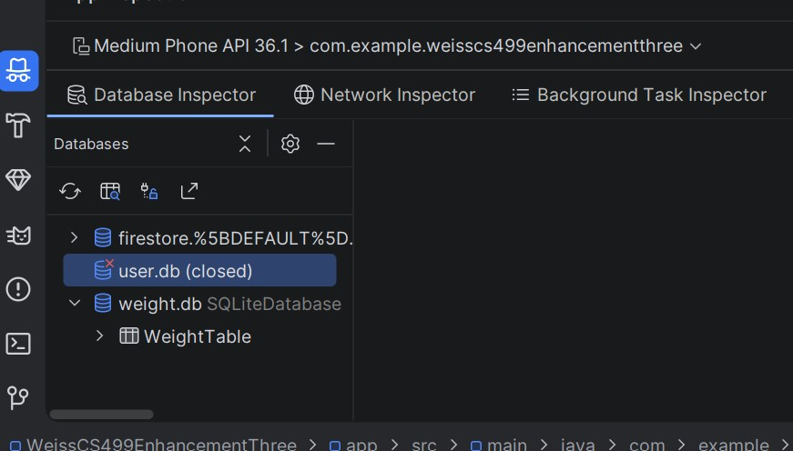

# Introduction and Self Assessment

My name is Scott, and I began pursuing my degree in Computer Science in the fall of 2024. While working full-time while also going to school, utilizing time management has been essential throughout the program, while also further developing problem-solving skills from working through projects, and learning to adapt to new challenges. 

Throughout the program, I’ve had to collaborate in a team environment through regular discussions as well as working together to solve complex problems. Through the assignments that I’ve worked on, I would consider, “Who I was designing this for? Who might collaborate on this in the future? Who might be a stakeholder on this?” Thinking about these and having this mindset helps to put more focus on creating more professional code that would be more user friendly that could be collaborated on. 

I believe that I’ve gained proficiency in targeted areas such as data structures and algorithms, software design and engineering, and security. These aspects have been shown in this ePortfolio through the three enhancements, but also from other courses in the program, like working with CRUD operations for a database for information to be kept and used by an online website with MongoDB, as well as working with binary search trees to sort and search through data, using databases like SQLite while working with Android Studio applications, and JUnit and Maven testing while searching through to find and fix dependencies. All of these experiences helped to solidify proper practices in creating secure and clean code. 

# Portfolio Summary

The capstone class for this program focused on choosing artifacts and enhancements in three categories that would display skills acquired throughout the program, which were: 

1. Software Design and Engineering 

2. Algorithms and Data Structures 

3. Databases 

The original artifact chosen for all three enhancements was my CS 360 Android Studio project, which was an app that was created in Java to allow a user to input and track their weight.  

The first enhancement, for the software design and engineering category, set out to change over the original Java code over to a new programming language which was chosen to be Kotlin. This enhancement also focused on cleaning up the existing code to be cleaner and more professional. This particular enhancement set out to demonstrate my ability to adapt an existing program for more modern usage while also focusing on delivering a professional, clean code environment that allowed for more collaborative efforts in the future.  

The second enhancement, for the second category of algorithms and data structures, set out to add a new screen to the existing app which would sort and display the user’s weight data in a graph. As Android Studio lacks the native capacity for this, I used a tool called MPAndroidChart (PhilJay, n.d.) to help. This enhancement demonstrated my ability to seek out and use innovative tools that use algorithmic principles to help solve this given problem, despite design trade-offs due to functionality limitations. 

The third enhancement, for the third and last category of databases, set out to replace the current database of the existing Android Studio app, which was SQLite, with a new database. In this case, using Firebase/Firestore. This enhancement not only used an innovative tool, but also displays that a security mindset is at the forefront, as according to its documentation, the data would automatically be encrypted upon being written to Cloud Firestore (*Server-side encryption / Firestore / Firebase*, n.d.).  

[Self Assessment and Portfolio Summary](https://github.com/ScottMWeiss/CS499/blob/main/CS%20499%20-%20Self%20Assessment%20-%20Weiss.docx)

# Course Outcomes

- Employ strategies for building collaborative environments that enable diverse audiences to support organizational decision making in the field of computer science.

- Design, develop, and deliver professional-quality oral, written, and visual communications that are coherent, technically sound, and appropriately adapted to specific audiences and contexts.

- Design and evaluate computing solutions that solve a given problem using algorithmic principles and computer science practices and standards appropriate to its solution, while managing the trade-offs involved in design choices.

- Demonstrate an ability to use well-founded and innovative techniques, skills, and tools in computing practices for the purpose of implementing computer solutions that deliver value and accomplish industry-specific goals.

- Develop a security mindset that anticipates adversarial exploits in software architecture and designs to expose potential vulnerabilities, mitigate design flaws, and ensure privacy and enhanced security of data and resources.

# Code Review

The following code review video goes over the original artifact, and goes into each enhancement that will be performed and various improvements that will be implemented.

[CS 499 Code Review](https://www.youtube.com/watch?v=oYhBLnIxIvQ)

# Category One: Software Design and Engineering
## Narrative
**Description:**  The original artifact chosen for this enhancement was the CS 360 Android Studio project, which was created earlier this year in the final part of the March-April 2026 SNHU term. The project itself allowed the students to choose from three potential situations, in which I chose the weight tracking project. This project would then allow a user to create an account, use that information to login, and then would be able to enter in weight information to track their progress towards their goal.

**Justification:** I chose this artifact originally to enhance for two main reasons: First, it was a more recently finished project that was fresher in my memory to make better changes to. Second, this particular project was one of the few projects during a student's time at SNHU where the entire project was student created, being built from the ground up from scratch and could show more original work that was created and showcase that original talent.
 
The artifact itself for this enhancement was improved by moving the code from its original code being Java, over to the new language of Kotlin. Some additional aspects were improved such as cleaning up unused variables and imports or removing commented out test code that remained from the original project.

Original Code Sample: 

Enhanced Code Sample:

**Reflection:**  One aspect that was learned was learning all of the different aspects of the new language in how that related to the older code, in how that changed how the code looked overall and in what ways the new code would interact with each other.  One challenge that was faced was ensuring that proper program functionality was maintained through the conversion process. Ensuring to run the project and go through the different steps of the app while watching other screens such as the database entries to ensure none of the aspects of the app were nonfunctional.

The two course outcomes I sought to meet with this enhancement were:

- Employ strategies for building collaborative environments that enable diverse audiences to support organizational decision making in the field of computer science.
   
- Design, develop, and deliver professional-quality oral, written, and visual communications that are coherent, technically sound, and appropriately adapted to specific audiences and contexts.

The first enhancement I believe was successfully met through this enhancement, by moving the language to a more commonly used app language and maintaining cleaned up code with comments, it allows for a more diverse audience to collaborate on. The second outcome was mostly met, but was fully realized with implementations of the other enhancements as well.

[Original Artifact](https://github.com/ScottMWeiss/CS499/blob/main/Artifact%201%20-%20Software%20Design%20and%20Engineering/Original%20Artifact/WeissCS360Files.zip) | [Full Narrative](https://github.com/ScottMWeiss/CS499/blob/main/Artifact%201%20-%20Software%20Design%20and%20Engineering/Enhanced%20Artifact/CS%20499%20-%20Milestone%20Two%20Enhancement%20One%20Narrative%20-%20Weiss.docx) | [Enhanced Artifact](https://github.com/ScottMWeiss/CS499/blob/main/Artifact%201%20-%20Software%20Design%20and%20Engineering/Enhanced%20Artifact/WeissCS499EnhancementOne.zip)

# Category Two: Algorithms and Data Structures
## Narrative
**Description:**  The artifact chosen for this enhancement was the same CS 360 Android Studio project used for the first enhancement, which was created earlier this year in the final part of the March-April 2026 SNHU term. The project itself allowed the students to choose from three potential situations, in which I chose the weight tracking project. This project would then allow a user to create an account, use that information to login, and then would be able to enter in weight information to track their progress towards their goal.

**Justification:**  I chose this artifact originally to enhance for two main reasons: First, it was a more recently finished project that was fresher in my memory to make better changes to. Second, this particular project was one of the few projects during a student's time at SNHU where the entire project was student created, being built from the ground up from scratch and could show more original work that was created and showcase that original talent.

This specific enhancement for the artifact was improved by adding in a new graph screen to visually see the data entered in by the user, which can be seen in the images below. 

Graph Code Section:

Graph Fragment Screen Sample:

In the Graph Fragment Screen Sample, the graph fragment screen is shown running in the app in Android Studio using sample weight data entered into the database. As Android Studio seems to lack the native ability to make graphs itself, outside tools were necessary to assist in this process. For this enhancement, the tool MPAndroidChart (PhilJay, n.d.) was used to take data from the database and display it into a graph, as well as referencing other material for use in the coding shown in the Graph Code Section in order to understand and implement the necessary code, such as from Yilmaz (2019).

**Reflection:**  Some aspects that I learned were more learning how coding in Kotlin worked and how that interacted with the tool being used to help create the graph, and became more familiar with the new coding style, as well as how to implement new features into Android Studio and how those could be used within the program, which will be helpful moving into the next enhancement with implementing a new database.

Some challenges that were faced were mainly issues with the tool itself. It’s unclear where the underlying issues reside, as a lot of the code base of the tool seems to be from years ago being the latest release is from 2019 so it’s possible there’s compatibility issues with the more modern version of Android Studio, but trying to implement certain aspects were problematic to say the least. One example is I was using test data when initially trying to make sure the created code itself worked before reading data from the database. The x-axis labels would refuse to show up or the code would produce array out of bounds errors if the amount of test data was too small, something I only learned about from an offhand GitHub issue page comment about a week later after multiple attempts to get it to work that wasn’t even about that specific issue. I was using sample arrays of about five entries to initially test the graph, and apparently using about 10 or more data entries in the arrays magically caused it to start working better. Some design choices had to be limited, some attempts to design the graph in certain ways were leading to some of the errors like the out of bounds errors that came up, and it’s still unclear why those issues persisted even after spending too much time researching more into the tool itself, so I had to settle for what I was able to get out of it, even after having to rollback and use an older version of the tool in order to get it to function.

The original course outcome this meant to achieve was the following:

- Design and evaluate computing solutions that solve a given problem using algorithmic principles and computer science practices and standards appropriate to its solution, while managing the trade-offs involved in design choices.
   
I believe this enhancement met this course outcome, as well as helped meet a couple others as well, being:

- Design, develop, and deliver professional-quality oral, written, and visual communications that are coherent, technically sound, and appropriately adapted to specific audiences and contexts.
   
- Demonstrate an ability to use well-founded and innovative techniques, skills, and tools in computing practices for the purpose of implementing computer solutions that deliver value and accomplish industry-specific goals.
   
As it delivered in terms of visually communicating a clean graph through concise code that used unique tools to implement a solution to a problem.

[Original Artifact](https://github.com/ScottMWeiss/CS499/blob/main/Artifact%202%20-%20Algorithms%20and%20Data%20Structures/Original%20Artifact/WeissCS360Files.zip) | [Full Narrative](https://github.com/ScottMWeiss/CS499/blob/main/Artifact%202%20-%20Algorithms%20and%20Data%20Structures/Enhanced%20Artifact/CS%20499%20-%20Milestone%20Three%20Enhancement%20Two%20Narrative%20-%20Weiss.docx) | [Enhanced Artifact](https://github.com/ScottMWeiss/CS499/blob/main/Artifact%202%20-%20Algorithms%20and%20Data%20Structures/Enhanced%20Artifact/WeissCS499EnhancementTwo.zip)

# Category Three: Databases
## Narrative
**Description:**  The artifact chosen for this enhancement was the same CS 360 Android Studio project used for the first two enhancements, which was created earlier this year in the final part of the March-April 2026 SNHU term. The project itself allowed the students to choose from three potential situations, in which I chose the weight tracking project. This project would then allow a user to create an account, use that information to login, and then would be able to enter in weight information to track their progress towards their goal.

**Justification:**  I chose this artifact originally to enhance for two main reasons: First, it was a more recently finished project that was fresher in my memory to make better changes to. Second, this particular project was one of the few projects during a student's time at SNHU where the entire project was student created, being built from the ground up from scratch and could show more original work that was created and showcase that original talent.

For this particular enhancement for the artifact, it was sought to be improved by switching the data being used from being in the native SQLite database used by Android Studio, over to the Firebase/Firestore database stored online. Part of this was achieved, as shown below:

Firebase/Firestore Sample:

In the Firebase/Firestore Sample image, it can be seen that writing the data to the database was successful. However, there became problems later when pulling the data from the database, which will be described in more detail later in this narrative.

**Reflection:**  One of the things I learned when working on this enhancement was more initial research needs to be done on the specifics of something before planning to implement. While writing data to the new database was easy, bringing that data back to the program to use was the main problem, as it turns out Firebase/Firestore is asynchronous. For example, when looking to call the database to check if the user credentials were accurate, it called to another function in the program to do so, and would return whether it was true or false. So while my program initially was calling the data to be requested, the rest of the function would continue to run normally regardless of whether the data had been returned or not. So the user credentials were being returned as false even if they were true, and the database call would later return as much but just not in time.

Attempts to correct this involved ways such as trying to slow down the program to give time for the call to operate, or implement asynchronous programming methods to be able to handle the call more appropriately, or even moving the part of the process that called the database to function sooner. However, all of these proved ineffective. Part of the asynchronous attempts were trying to use Kotlin coroutines and suspension methods, however these proved ineffective as they can only be used in very specific ways that were not usable in my program in its current state, such as suspension only being allowed to be used by other suspension classes, and having to make each method a suspension all the way back to the OnViewCreated method in the fragment screen, however the OnViewCreated is not allowed to be used in such a way so those methods were unable to be used.

In part of my research on this subject in my attempts to get it fully operational, I found examples of Firebase/Firestore being used in Android Studio, so I know it’s possible in the long run. However, I believe that due to the original synchronous nature of how my overall program was written as it was originally written with using SQLite to be used, I believe the entire program would have to be rewritten with the new specific database in mind in order for it to function properly, with writing classes specifically designed with using asynchronous programming methods given the nature of the new database. 

In an attempt to still implement security on the original SQLite database, I implemented another innovative tool called SQLCipher in order to seek to encrypt at least the user information in the user database, which I have included the license information later in this narrative. (*SQLCipher Community Edition - Open Source Information / Zetetic*, n.d.)

SQLCipher Imports:

In the SQLCipher Imports image, after implementing the necessary fields into the Gradle of the application, I transitioned the imports to the new SQLite Database and Helper imports. Initially, before the changes made, the databases would look like below in the Android Studio inspector:

Before Logging In:

After Logging In:

Before the changes, as shown in Image 3 and 4, the database inspector would show the database information cleanly to the user. After implementation:

Logging In After Implementation:

In the Logging In After Implementation image, the user.db was closed off to the user after logging in even though the weight database is still viewable, but still able to login using that information stored in the database. 

Overall, there were challenges met with this final enhancement. Some of the initial goals were met, but I definitely learned to do more research on just what specifically will be needed when implementing new features or tools. Moving forward, in the future in order to properly implement the full Firebase/Firestore database, as mentioned earlier I believe the entire program would need to be built up and rewritten with using the new database in mind, implementing more asynchronous programming features such as Kotlin co-routines.

The two outcomes this enhancement originally sought to achieve were:

- Demonstrate an ability to use well-founded and innovative techniques, skills, and tools in computing practices for the purpose of implementing computer solutions that deliver value and accomplish industry-specific goals.
   
- Develop a security mindset that anticipates adversarial exploits in software architecture and designs to expose potential vulnerabilities, mitigate design flaws, and ensure privacy and enhanced security of data and resources.
   
I would say they were at least partially met. With the writing of data to the new database, it was both using an innovative tool to securely store data, as “Cloud Firestore automatically encrypts all data before it is written to disk.” (*Server-side encryption  /  Firestore  /  Firebase*, n.d.) Then, with using SQLCipher to help encrypt local data, these were fully met.

[Original Artifact](https://github.com/ScottMWeiss/CS499/blob/main/Artifact%203%20-%20Databases/Original%20Artifact/WeissCS360project3WeightTrackApp.zip) | [Full Narrative](https://github.com/ScottMWeiss/CS499/blob/main/Artifact%203%20-%20Databases/Enhanced%20Artifact/CS%20499%20-%20Milestone%20Four%20Enhancement%20Three%20Narrative%20-%20Weiss.docx) | [Enhanced Artifact](https://github.com/ScottMWeiss/CS499/blob/main/Artifact%203%20-%20Databases/Enhanced%20Artifact/WeissCS499EnhancementThree.zip)

The license information below was pulled from the Zetetic website about using the SQLCipher Community Edition of the program. (*SQLCipher Community Edition - Open Source Information / Zetetic*, n.d.)

[SQLCipher License Information](https://github.com/ScottMWeiss/CS499/blob/main/Artifact%203%20-%20Databases/Enhanced%20Artifact/SQLCipher%20License%20Information.txt)

# References
PhilJay. (n.d.). *GitHub - PhilJay/MPAndroidChart: A powerful 🚀 Android chart view / graph view library, supporting line- bar- pie- radar- bubble- and candlestick charts as well as scaling, panning and animations.* GitHub. [https://github.com/PhilJay/MPAndroidChart/tree/master](https://github.com/PhilJay/MPAndroidChart/tree/master)

*Server-side encryption / Firestore / Firebase*. (n.d.) Firebase [https://firebase.google.com/docs/firestore/enterprise/server-side-encryption](https://firebase.google.com/docs/firestore/enterprise/server-side-encryption)

*SQLCipher Community Edition - Open Source Information / Zetetic*. (n.d.). [https://www.zetetic.net/sqlcipher/community/](https://www.zetetic.net/sqlcipher/community/)

Yilmaz, V. (2019, November 27). *Kotlin Line Chart.* Medium. [https://medium.com/@yilmazvolkan/kotlinlinecharts-c2a730226ff1](https://medium.com/@yilmazvolkan/kotlinlinecharts-c2a730226ff1)
